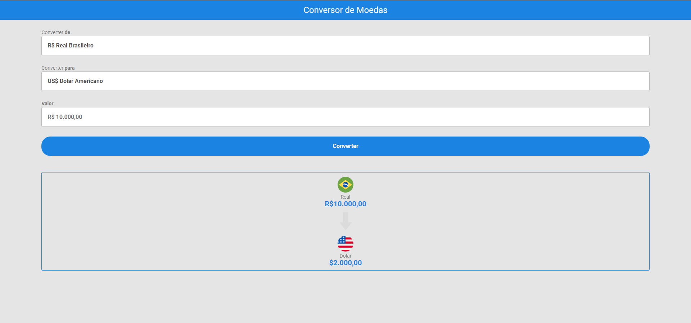
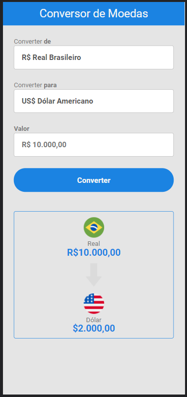

# currency-converter

Esse é o meu primeiro projeto utilizando HTML | CSS | JavaScript juntos.

O projeto é um Conversor de Moedas com as opções:

Real => Dólar
Real => Euro
Real => Bitcoin

as conversões para Dólar e Euro são feitas em valor real/atualizado que é fornecido por uma API, já o valor do Bitcoin é genérico.
 
 
Habilidades adquiridas:

• Posicionei elementos utilizando display grid e display flex no CSS

• Utilizei o JS para manipular elementos do HTML através de eventos

• Utilizei o método fetch para consumir uma API no JS
 
 
O site está totalmente responsivo:
 
 
• Desktop:
 

•Mobile:
 

